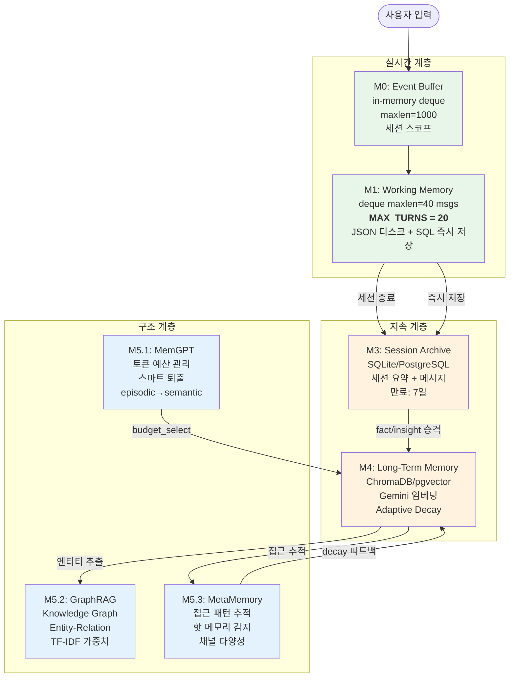
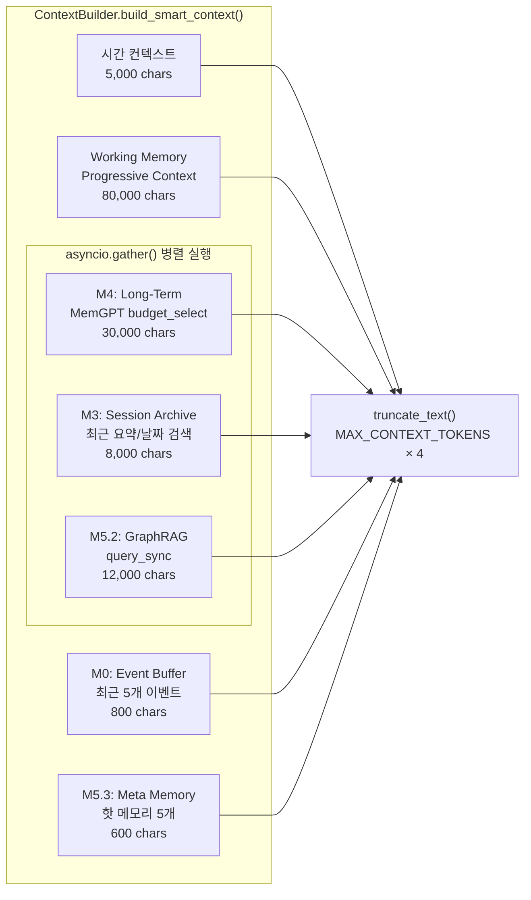
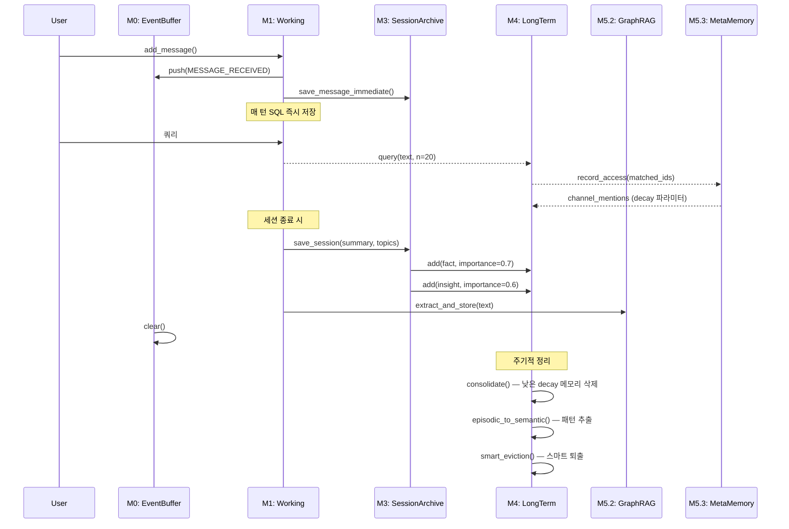
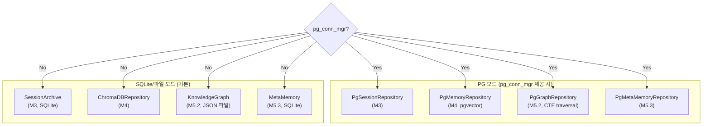

# axnmihn 메모리 시스템 분석 보고서

## 1. 아키텍처 개요

### 7계층 메모리 파이프라인 (M0, M1, M3, M4, M5.1–M5.3)

> **참고:** M2는 아키텍처에서 사용되지 않음. 코드 docstring 기준 넘버링.



---

## 2. 각 계층 상세 분석

### M0: Event Buffer (`backend/memory/event_buffer.py`)

| 항목 | 값 |
|------|-----|
| 저장소 | `deque(maxlen=1000)` in-memory |
| 수명 | 세션 스코프 (세션 종료 시 clear) |
| 이벤트 종류 | `MESSAGE_RECEIVED`, `SESSION_START/END`, `MEMORY_ACCESSED`, `ENTITY_EXTRACTED`, `TOOL_EXECUTED` |
| 컨텍스트 예산 | 200 tokens (800 chars) |
| 핸들러 | async dispatch 지원 |

### M1: Working Memory (`backend/memory/current.py`)

| 항목 | 값 |
|------|-----|
| **MAX_TURNS** | **20** (`CONTEXT_WORKING_TURNS` 환경변수, 기본값 20) |
| 메시지 deque | `maxlen = MAX_TURNS * 2 = 40` (user+assistant 쌍) |
| SQL 영속 턴 | 10 (`CONTEXT_SQL_PERSIST_TURNS`) |
| Progressive Context | 최근 10턴 전문 + 이전 턴 요약(300-500자) |
| 컨텍스트 예산 | 80,000 chars (≈20,000 tokens) |
| 시간 인식 | `get_time_elapsed_context()` — 방금/N분 전/N시간 만에 재개 등 |
| 영속화 | JSON 디스크 저장 + 매 턴 SQL 즉시 저장 |

### M3: Session Archive (`backend/memory/recent/`)

| 항목 | 값 |
|------|-----|
| 저장소 | SQLite (`sessions` + `messages` + `archived_messages` 테이블) 또는 PostgreSQL |
| 만료 | `MESSAGE_ARCHIVE_AFTER_DAYS = 7` |
| 세션 요약 | LLM 기반 (실패 시 fallback 요약) |
| 요약 내용 | summary, key_topics, emotional_tone, facts_discovered, insights_discovered |
| 컨텍스트 예산 | 8,000 chars (≈2,000 tokens) |
| 쿼리 | 날짜별, 토픽별, 최근 요약 |
| Interaction Logs | 모델별/tier별 사용 통계 |

### M4: Long-Term Memory (`backend/memory/permanent/`)

| 항목 | 값 |
|------|-----|
| 저장소 | ChromaDB 또는 pgvector (PostgreSQL) |
| 임베딩 | Gemini `gemini-embedding-001` (config에서 설정) |
| 검색 | 하이브리드 (벡터 70% + 텍스트 30%) |
| Decay | Adaptive Decay — 타입별, 접근 횟수, 그래프 연결, 채널 다양성, 리센시 패러독스 |
| Promotion | importance ≥ MIN_IMPORTANCE 또는 (repetitions ≥ 2 && importance ≥ 0.35) |
| 중복 제거 | ContentKeyGenerator (한국어 조사 제거) + 유사도 임계값 |
| 통합 | MemGPTManager — 토큰 예산 기반 선택, 스마트 퇴출, episodic→semantic 변환 |
| 컨텍스트 예산 | 30,000 chars (≈7,500 tokens) |
| 네이티브 가속 | C++ `axnmihn_native` 모듈 (배치 decay 계산 50-100x 속도 향상) |

**Decay 공식:**
```
stability = 1 + ACCESS_STABILITY_K × ln(1 + access_count)
resistance = min(1.0, connection_count × RELATION_RESISTANCE_K)
channel_boost = 1 / (1 + CHANNEL_DIVERSITY_K × channel_mentions)
effective_rate = BASE_DECAY_RATE × type_multiplier × channel_boost / stability × (1 - resistance)
decayed = importance × exp(-effective_rate × hours_passed)

# Recency Paradox: 1주 이상 오래된 메모리가 24시간 내 접근 → ×1.3 부스트
# 최소 유지: max(decayed, importance × MIN_RETENTION)
```

**타입별 Decay 속도:**
| 타입 | 배율 | 의미 |
|------|------|------|
| fact | 0.3 | 매우 느림 |
| preference | 0.5 | 중간 |
| insight | 0.7 | 약간 빠름 |
| conversation | 1.0 | 기본 속도 |

### M5.2: Knowledge Graph (`backend/memory/graph_rag/`)

| 항목 | 값 |
|------|-----|
| 저장소 | JSON 파일 또는 PostgreSQL (entities/relations 테이블) |
| 엔티티 중복 제거 | 이름 정규화 + O(1) name_index |
| 관계 가중치 | TF-IDF 기반 재계산 (`0.7 × TF × IDF + 0.3 × baseline`) |
| 탐색 | BFS (Python) 또는 C++ native BFS (≥100 엔티티 시) |
| PG 최적화 | Recursive CTE + LATERAL JOIN + weight 프루닝 |
| 쿼리 | LLM 기반 엔티티 추출 → 그래프 탐색 → 컨텍스트 포맷팅 |
| 컨텍스트 예산 | 12,000 chars (≈3,000 tokens) |
| Stopwords | 일반적 개념 엔티티 필터링 |

### M5.3: Meta Memory (`backend/memory/meta_memory.py`)

| 항목 | 값 |
|------|-----|
| 추적 대상 | memory_id → access_count, channel_diversity |
| 패턴 저장 | 최근 10,000개 (bounded deque) |
| 핫 메모리 | 가장 빈번히 접근된 메모리 상위 N개 |
| Decay 피드백 | `channel_mentions` → M3 Adaptive Decay의 `CHANNEL_DIVERSITY_K` 파라미터 |
| 컨텍스트 예산 | 150 tokens (600 chars) |
| 영속화 | SQLite `access_patterns` 테이블 또는 PostgreSQL |

---

## 3. 컨텍스트 빌딩 파이프라인



**토큰 예산 (기본값):**

| 섹션 | chars | ≈ tokens | 우선순위 |
|------|-------|----------|---------|
| System Prompt | 20,000 | 5,000 | 1 |
| 시간 컨텍스트 | 5,000 | 1,250 | 1 |
| Working Memory | 80,000 | 20,000 | 1 (overflow: summarize) |
| Long-Term | 30,000 | 7,500 | 1 |
| GraphRAG | 12,000 | 3,000 | 1 |
| Session Archive | 8,000 | 2,000 | 1 |
| Event Buffer | 800 | 200 | 2 |
| Meta Memory | 600 | 150 | 2 |
| **합계** | **≈156,400** | **≈39,100** | — |

---

## 4. 데이터 흐름 (라이프사이클)



---

## 5. PostgreSQL vs SQLite/ChromaDB 백엔드



---

## 6. 잘된 점 ✅

### 6.1 견고한 계층 분리
- 각 계층이 명확한 책임을 가지고 독립적으로 동작
- M0(휘발성) → M1(세션) → M2(아카이브) → M3(영구) 승격 경로가 자연스러움
- 계층별 독립 교체 가능 (ChromaDB ↔ pgvector, SQLite ↔ PostgreSQL)

### 6.2 Adaptive Decay 시스템
- 메모리 타입별 차별화된 감쇠율 (fact 0.3 vs conversation 1.0)
- 접근 빈도, 그래프 연결, 채널 다양성까지 고려한 다인자 decay
- Recency Paradox 처리 (오래된 메모리가 최근 접근 시 부스트)
- C++ 네이티브 배치 연산으로 대량 메모리 처리 최적화

### 6.3 MemGPT 스타일 토큰 예산 관리
- `context_budget_select()` — 토픽 다양성 + 토큰 예산 내 최적 메모리 선택
- `smart_eviction()` — 낮은 가치 메모리 자동 정리
- `episodic_to_semantic()` — 에피소딕 → 시맨틱 메모리 변환 (LLM 활용)

### 6.4 컨텍스트 최적화
- `ContextOptimizer` — 섹션별 예산, overflow 전략 (truncate/summarize/drop)
- Progressive Context — 오래된 턴은 요약, 최근 10턴은 전문
- `asyncio.gather()` 3-way 병렬 fetch (M2, M3, M4)

### 6.5 성능 최적화
- PERF-008: O(1) 인덱스 (name→entity_id, entity→relations)
- PERF-019: 한국어 조사 제거 단일 regex
- PERF-021/023: batch `executemany` + batch metadata update
- PERF-028: 단일 regex 로그 패턴 필터
- PERF-039: bounded deque (무한 리스트 방지)
- PERF-042: batch entity name lookup, async graph save
- C++ native BFS (≥100 노드), native decay 배치 연산

### 6.6 보안
- `sanitize_input()` — 사용자 입력 프롬프트 방어
- `filter_output()` — 출력 필터링
- 중복 방지: ContentKeyGenerator + embedding 유사도 체크

---

## 7. 개선이 필요한 점 ⚠️

### 7.1 M0 ↔ M5.3 연결 부재
- **현상**: M0(Event Buffer)와 M5.3(Meta Memory)가 독립적으로 동작
- **문제**: M0의 `MEMORY_ACCESSED` 이벤트가 M5.3의 `record_access()`로 자동 전파되지 않음
- **제안**: Event Buffer 핸들러로 Meta Memory 접근 추적 자동 연결

### 7.2 M3 → M4 승격 경로가 세션 종료에만 의존
- **현상**: fact/insight 승격이 `end_session()` 콜백에서만 발생
- **문제**: 장시간 세션 중 중요한 정보가 M4로 승격되지 않아 세션 중단 시 유실 가능
- **제안**: 주기적 중간 승격 (예: N턴마다 또는 importance 기준 즉시 승격)

### 7.3 M5.2 GraphRAG query와 M4 검색의 결합 부재
- **현상**: 컨텍스트 빌딩에서 M4(semantic search)와 M5.2(graph query)가 독립 실행
- **문제**: 그래프에서 발견된 엔티티가 M4 검색에 활용되지 않고, M4 결과가 M5.2 탐색을 가이드하지 않음
- **제안**: M5.2 결과의 엔티티 이름을 M4 검색 쿼리에 보강하는 cross-layer 피드백

### 7.4 Dynamic Decay가 Feature Gate 뒤에 비활성 상태
- **현상**: `dynamic_decay.py`의 사용자 행동 기반 decay 파라미터 조정이 `DYNAMIC_DECAY_ENABLED=false`
- **문제**: circadian stability, 사용자별 engagement scoring이 실제 decay에 반영되지 않음
- **영향**: 모든 사용자에게 동일한 decay rate 적용

### 7.5 Sync/Async 이중 경로
- **현상**: `_build_smart_context_sync()` vs `_build_smart_context_async()` 양쪽 모두 유지
- **문제**: sync 경로에서 M0/M5 컨텍스트가 포함되지만 async 경로에서는 누락됨
- **불일치**: sync 경로는 6개 소스, async 경로는 4개 소스 (event_buffer, meta_memory 누락)

### 7.6 Session Archive 만료 정리 미자동화
- **현상**: `get_expired_sessions()`로 만료 세션을 찾을 수 있지만 자동 정리 스케줄러 없음
- **문제**: 만료된 세션 데이터가 수동 정리 전까지 디스크 공간 점유

### 7.7 MemGPT `episodic_to_semantic` 임계값이 관대
- **현상**: `min_episodic_repetitions = 1`, `semantic_threshold_days = 5`
- **문제**: 1회만 언급된 에피소딕 메모리도 5일 후 시맨틱 변환 대상 — 노이즈 위험
- **제안**: `min_episodic_repetitions = 2` 이상으로 조정

### 7.8 컨텍스트 예산 과다
- **현상**: 기본 총 예산이 ~39,000 tokens (Working Memory만 20,000 tokens)
- **문제**: 대부분의 LLM 모델에서 불필요하게 큰 컨텍스트 → 비용 증가, 집중력 분산
- **제안**: 모델별 동적 예산 조정 또는 컨텍스트 압축 전략 도입

---

## 8. 유기적 연결성 평가

### 연결 매트릭스

```
       M0   M1   M3   M4   M5.1  M5.2  M5.3
M0     —    ✅   ❌   ❌   ❌    ❌    ❌
M1     ✅   —    ✅   ❌   ❌    ❌    ❌
M3     ❌   ✅   —    ✅   ❌    ❌    ❌
M4     ❌   ❌   ✅   —    ✅    ⚠️    ✅
M5.1   ❌   ❌   ❌   ✅   —     ❌    ❌
M5.2   ❌   ❌   ❌   ⚠️   ❌    —     ❌
M5.3   ❌   ❌   ❌   ✅   ❌    ❌    —

✅ = 직접 데이터 흐름 존재
⚠️ = 간접적/불완전한 연결
❌ = 연결 없음
```

### 핵심 연결 분석

| 연결 | 상태 | 설명 |
|------|------|------|
| M0 → M1 | ✅ | 메시지 이벤트가 Working Memory에 push |
| M1 → M3 | ✅ | 매 턴 `save_message_immediate()` + 세션 종료 시 `save_session()` |
| M3 → M4 | ✅ | 세션 요약에서 fact/insight 추출 → `long_term.add()` |
| M4 → M5.3 | ✅ | `query()` 시 `access_tracker`가 접근 기록 → M5.3 `record_access()` |
| M5.3 → M4 | ✅ | `channel_mentions`가 decay 계산에 피드백 |
| M5.1 → M4 | ✅ | `budget_select()`, `smart_eviction()` 등 M4 데이터 관리 |
| M4 ↔ M5.2 | ⚠️ | 같은 컨텍스트에 포함되지만 **서로의 결과를 활용하지 않음** |
| M0 ↔ M5.3 | ❌ | **이벤트와 접근 패턴 간 연결 없음** |
| M5.2 → M5.3 | ❌ | 그래프 엔티티 접근이 메타 메모리에 기록되지 않음 |

### 결론

**강한 연결**: M1 → M3 → M4 ↔ M5.3 (핵심 파이프라인이 잘 연결됨)

**약한 연결**: M0, M5.2가 나머지와 느슨하게 결합
- M0은 이벤트를 기록하지만 다른 계층에 영향을 주지 않음 (현재 컨텍스트 출력용에 그침)
- M5.2(GraphRAG)는 M4와 병렬로 동작하되 **교차 활용이 없음**

**전체 평가**: 핵심 메모리 파이프라인(M1→M3→M4)은 견고하게 연결되어 있으나, **M0과 M5.2가 "위성 모듈"처럼 독립 동작**하여 전체 계층의 잠재력을 완전히 활용하지 못하고 있음. M4↔M5.2 교차 검색과 M0→M5.3 이벤트 기반 접근 추적을 추가하면 유기적 시너지가 크게 향상될 수 있음.
